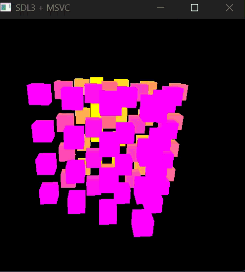
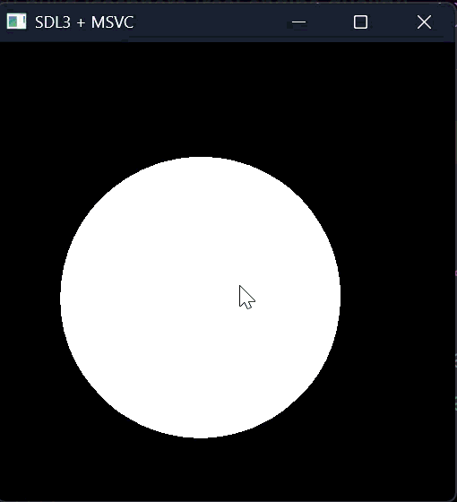
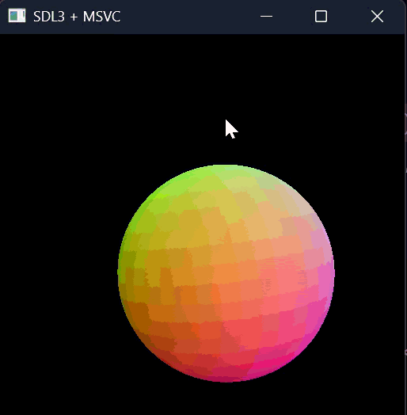

# 🎮 Pixel Renderer


A small software renderer built to understand how graphics actually work.

## 🔲 Cube Rendering Demo

<p align="center">
  
  
</p>

---

## 🔵 Sphere Rendering Demo

<p align="center">
  
  
</p>

<p align="center">
  <sub>Left: Low resolution sphere | Right: Higher resolution / improved shading</sub>
</p>
## ✨ What it does

- 🎥 Free camera movement + rotation  
- 🔺 Renders triangles (2D + 3D)  
- 🧊 Renders Cube
- 🔵 Sphere rendering  
- 🧠 Basic rendering pipeline (manual, no engine magic)

---

## 🎯 Why this exists

To learn:
- how 3D → 2D projection works  
- how cameras behave  
- how triangles become pixels  

---

## 🚧 Current limits

- No meshes  
- No lighting  
- No depth buffer  
- CPU only  

---

## ⚙️ Build

```bash
mkdir build
cd build
cmake ..
make
